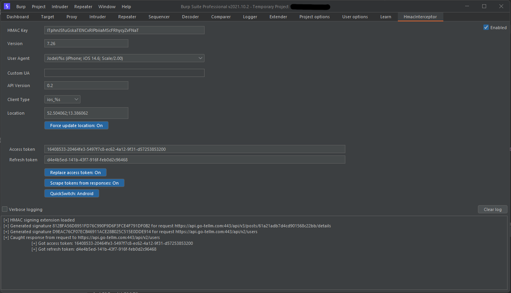

# Burp HmacInterceptor
[](https://forthebadge.com)

This extension is heavily based on the source of the [Java version of the JodelAPI](https://github.com/Jupiops/JodelAPI).
It is only usable as an extension for BurpSuite. 

This tool calculates the correct HMAC value based on the given secret and version and automatically modifies the request to hopefully work.
Additionally, it stores `access_` and `refresh_token` in Burp CookieJar and also automatically appends within the `Authorization`-header.

A prebuilt version is available in the [releases section](https://github.com/JodelRaccoons/JodelBurpHmac/releases/tag/alpha). 

**This project is for educational purposes only! Do not abuse it for anything unlawful!**

### Features
- Reads all `access_` and `refresh_tokens` coming within responses from the Server and stores them
- Adds/updates the stored `access_token` in the `Authorization`-Header
- Calculates the HMAC signature and adds the corresponding header (`X-Authorization`) to the request
- Adds/updates headers which are required for signing
  - `User-Agent`
  - `X-Timestamp`
  - `X-Client-Type`
  - `X-Api-Version`
  - `X-Location`

### Screenshot



### Setting up
- Load extension from jarfile
- Create session handling rule
  - Invoke extension
- Set scope of session handling rules: https://api.jodelapis.com / https://api.go-tellm.com
- Set tools of session handling rule
  - Only use repeater, all other requests are unmodifiable
  - Maybe proxy works too, untested

### Getting started
- Enter HMAC key and version number in HmacInterceptor tab (or use predefined ones)
- Adjust if you like
  - User agent
  - API version
  - Client type
  - Location
- Enter access_token and refresh_token if known
  - If unknown, you can also make a account registration request, the response will automatically be parsed and filled in
- Perform requests from repeater

For more help setting up, please consult [this directory](./png/).

### Examples
Before:
````http request
POST /api/v2/users/ HTTP/1.1
Host: api.jodelapis.com
Connection: close
Accept-Encoding: gzip, deflate
Accept-Language: en
Content-Length: 235
Content-Type: application/json

[...]
````

After:
````http request
POST /api/v2/users/ HTTP/1.1
X-Timestamp: 2021-11-10T18:01:12Z
X-Client-Type: android_7.25.8
X-Authorization: HMAC A5D7942FF7C0037D95B1917DF9C855C6EC1E1C72
Connection: close
User-Agent: Jodel/7.25.8 Dalvik/2.1.0 (Linux; U; Android 16; Pixel 9 Build/AAAA.123456.789)
Host: api.jodelapis.com
X-Location: 52.50401134649571;13.386128241378373
Accept-Encoding: gzip, deflate
Accept-Language: en
X-Api-Version: 0.2
Content-Length: 172
Content-Type: application/json

[...]
````

### Building

- ``./gradlew jar``
- Look within the ``./build/libs/`` folder for the generated jar
